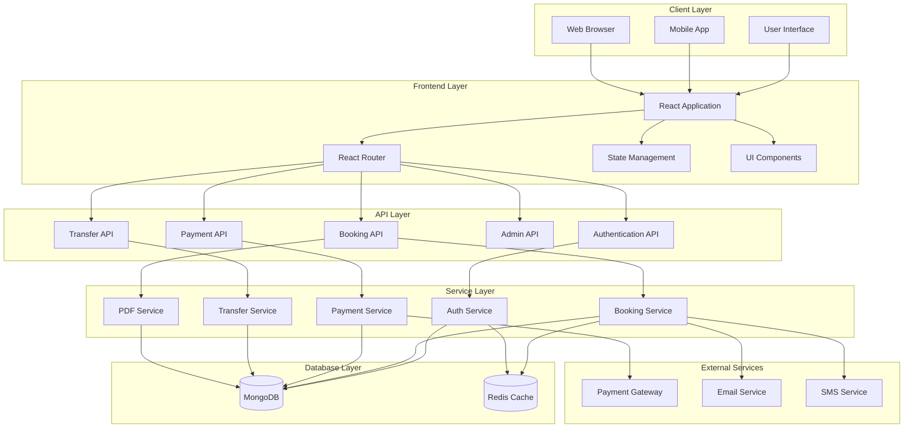

# Bus Booking System - Block Diagram

## Component Descriptions

### 1. Client Layer
- **User Interface**: Main application interface
- **Mobile App**: Mobile application interface
- **Web Browser**: Web-based interface

### 2. Frontend Layer
- **React Application**: Core frontend framework
- **React Router**: Navigation and routing
- **State Management**: Application state handling
- **UI Components**: Reusable interface components

### 3. API Layer
- **Authentication API**: User authentication and authorization
- **Booking API**: Bus booking operations
- **Payment API**: Payment processing
- **Admin API**: Administrative operations
- **Transfer API**: Seat transfer operations

### 4. Service Layer
- **Auth Service**: Authentication business logic
- **Booking Service**: Booking management logic
- **Payment Service**: Payment processing logic
- **Transfer Service**: Seat transfer logic
- **PDF Service**: Receipt generation

### 5. Database Layer
- **MongoDB**: Primary database
- **Redis Cache**: Caching layer

### 6. External Services
- **Payment Gateway**: Payment processing
- **Email Service**: Email notifications
- **SMS Service**: SMS notifications

## System Flow

1. **User Interaction**
   - Users interact with the system through UI, Mobile App, or Web Browser
   - All interactions are handled by the React Application

2. **Request Processing**
   - Requests are routed through React Router
   - State changes are managed by State Management
   - UI Components render the interface

3. **API Communication**
   - Frontend communicates with backend through REST APIs
   - Each API handles specific domain operations
   - Authentication is required for protected routes

4. **Business Logic**
   - Services implement business rules
   - Data validation and processing
   - Integration with external services

5. **Data Storage**
   - MongoDB stores persistent data
   - Redis Cache improves performance
   - Data consistency is maintained

6. **External Integration**
   - Payment processing through gateway
   - Email notifications for bookings
   - SMS notifications for updates

## Security Features

1. **Authentication**
   - JWT-based authentication
   - Role-based access control
   - Session management

2. **Data Protection**
   - HTTPS encryption
   - Input validation
   - XSS protection
   - CSRF protection

3. **Caching**
   - Redis caching for performance
   - Cache invalidation
   - Data consistency

## Performance Considerations

1. **Optimization**
   - Lazy loading
   - Code splitting
   - Image optimization
   - Caching strategies

2. **Scalability**
   - Horizontal scaling
   - Load balancing
   - Database indexing
   - Microservices architecture

3. **Monitoring**
   - Performance metrics
   - Error tracking
   - User analytics
   - System health checks 