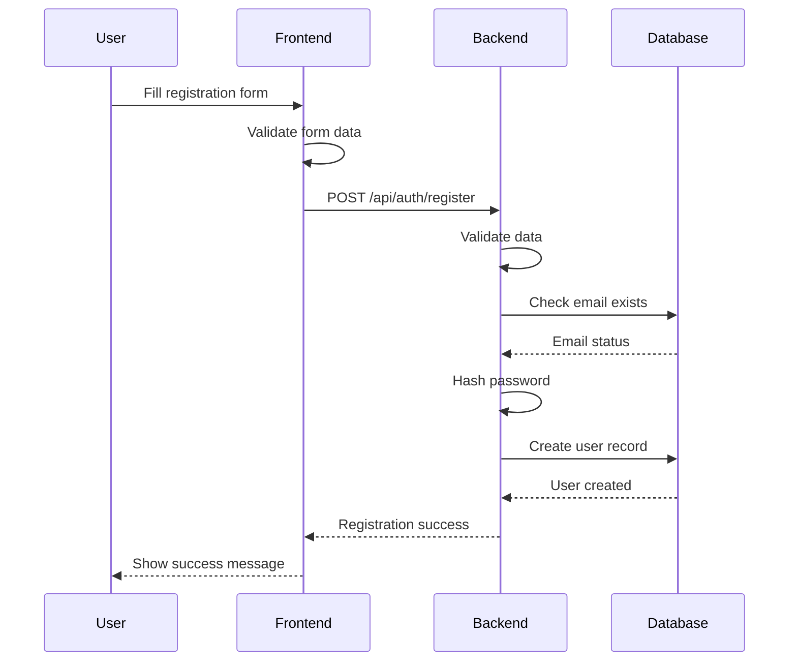
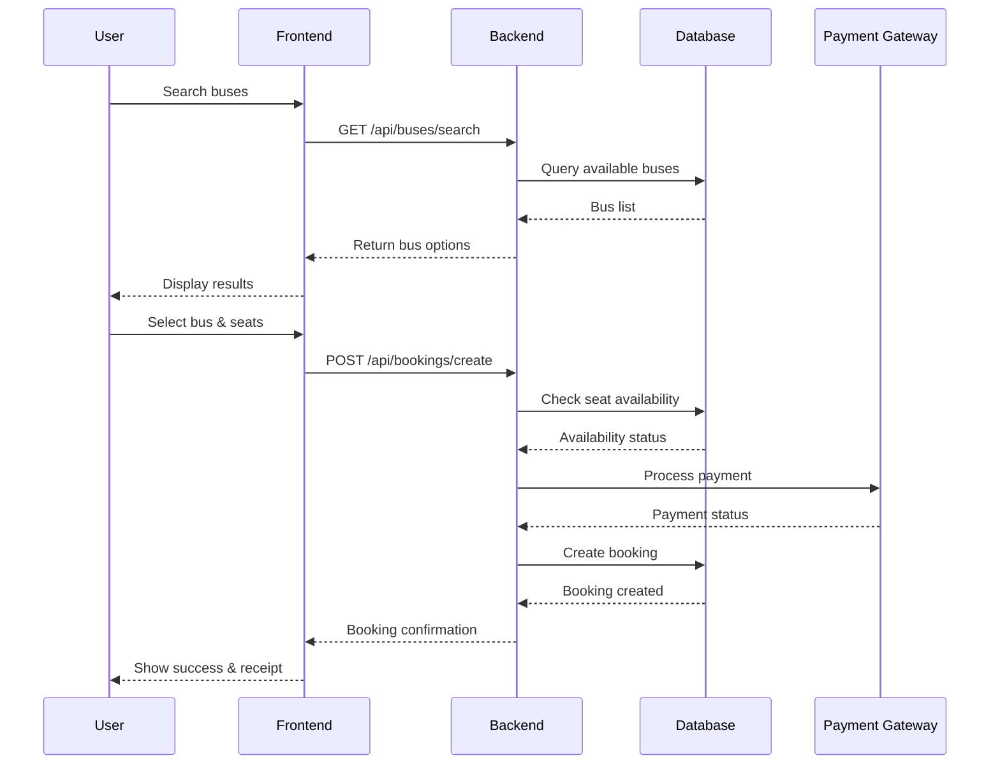
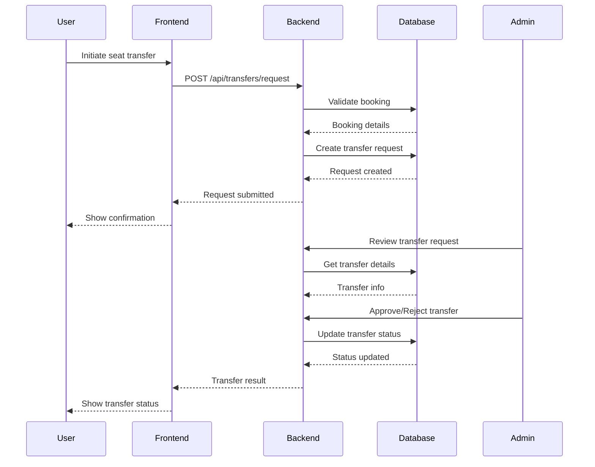
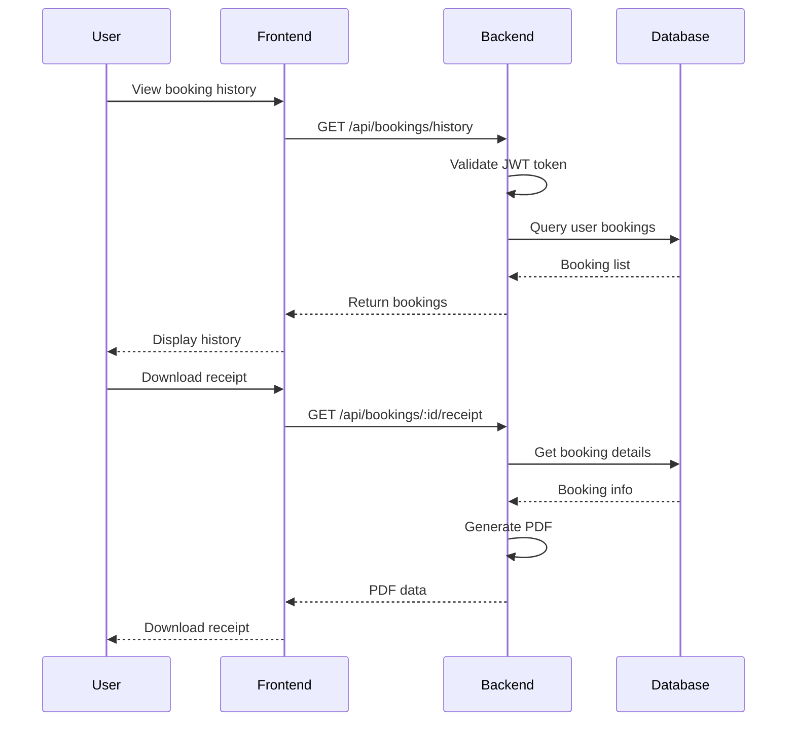
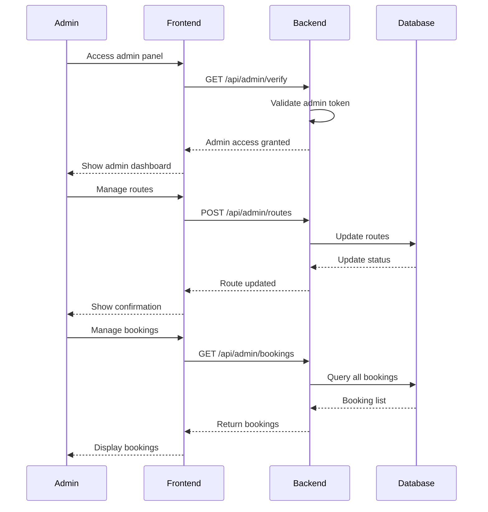

# Bus Booking System - Timing Diagram

## 1. User Registration Flow

## 2. Bus Booking Flow

## 3. Seat Transfer Flow

## 4. Booking History Flow

## 5. Admin Management Flow

## Notes:
1. All API calls include authentication headers
2. Error handling and validation occur at each step
3. Real-time updates are implemented for seat availability
4. Database operations are atomic and include proper locking
5. All sensitive data is encrypted in transit and at rest 